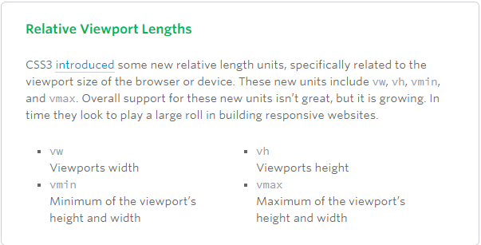
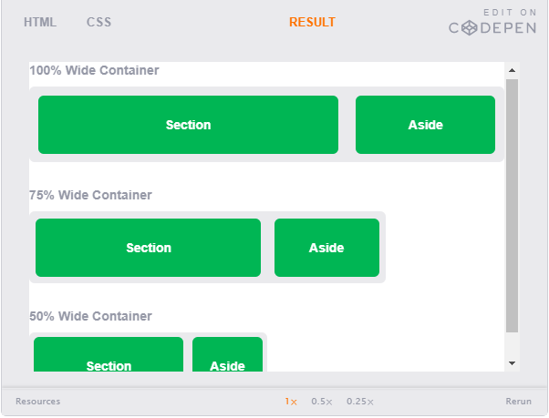

With the growth in mobile Internet usage comes the question of how to build websites suitable for all users. The industry response to this question has become responsive web design, also known as RWD.
# Responsive Web Design
Responsive web design is the practice of building a website suitable to work on every device and every screen size, no matter how large or small, mobile or desktop.

# Responsive vs. Adaptive vs. Mobile
Responsive and adaptive web design are closely related, and often transposed as one in the same. Responsive generally means to **react quickly and positively to any change**, while adaptive means to be **easily modified for a new purpose or situation, such as change**. With responsive design websites continually and fluidly change based on different factors, such as viewport width, while adaptive websites are built to a group of preset factors. A combination of the two is ideal, providing the perfect formula for functional websites. Which term is used specifically doesn’t make a huge difference.

Mobile, on the other hand, generally means to build a separate website commonly on a new domain solely for mobile users. While this does occasionally have its place, it normally isn’t a great idea. Mobile websites can be extremely light but they do come with the dependencies of a new code base and browser sniffing, all of which can become an obstacle for both developers and users.

## Flexible Layouts
Responsive web design is broken down into three main components, including:

1- flexible layouts.

2- media queries.

3- flexible media. 

The first part, flexible layouts, is the practice of building the layout of a website with a flexible grid, capable of dynamically resizing to any width. Flexible grids are built using relative length units, most commonly percentages or em units. These relative lengths are then used to declare common grid property values such as width, margin, or padding.



Flexible layouts do not advocate the use of fixed measurement units, such as pixels or inches. Reason being, the viewport height and width continually change from device to device. Website layouts need to adapt to this change and fixed values have too many constraints. Fortunately, Ethan pointed out an easy formula to help identify the proportions of a flexible layout using relative values.

The formula is based around taking the target width of an element and dividing it by the width of it’s parent element. The result is the relative width of the target element.

```
target ÷ context = result
```

### Flexible Grid
Using the flexible grid formula we can take all of the fixed units of length and turn them into relative units. In this example we’ll use percentages but em units would work equally as well. Notice, no matter how wide the parent container becomes, the section and aside margins and widths scale proportionally.

```
section,
aside {
  margin: 1.858736059%; /*  10px ÷ 538px = .018587361 */
}
section {
  float: left;
  width: 63.197026%;    /* 340px ÷ 538px = .63197026 */   
}
aside {
  float: right;
  width: 29.3680297%;  /* 158px ÷ 538px = .293680297 */
}
```



Taking the flexible layout concept, and formula, and reapplying it to all parts of a grid will create a completely dynamic website, scaling to every viewport size. For even more control within a flexible layout, you can also leverage the min-width, max-width, min-height, and max-height properties.

The flexible layout approach alone isn’t enough. At times the width of a browser viewport may be so small that even scaling the the layout proportionally will create columns that are too small to effectively display content. Specifically, when the layout gets too small, or too large, text may become illegible and the layout may begin to break. In this event, media queries can be used to help build a better experience.

## Media Queries
Media queries were built as an extension to media types commonly found when targeting and including styles. Media queries provide the ability to specify different styles for individual browser and device circumstances, the width of the viewport or device orientation for example. Being able to apply uniquely targeted styles opens up a world of opportunity and leverage to responsive web design.

### Initializing Media Queries
There are a couple different ways to use media queries, using the @media rule inside of an existing style sheet, importing a new style sheet using the @import rule, or by linking to a separate style sheet from within the HTML document. Generally speaking it is recommend to use the @media rule inside of an existing style sheet to avoid any additional HTTP requests.

```
<!-- Separate CSS File -->
<link href="styles.css" rel="stylesheet" media="all and (max-width: 1024px)">
```
```
/* @media Rule */
@media all and (max-width: 1024px) {...}

/* @import Rule */
@import url(styles.css) all and (max-width: 1024px) {...}
```

Each media query may include a media type followed by one or more expressions. Common media types include all, screen, print, tv, and braille. The HTML5 specification includes new media types, even including 3d-glasses. Should a media type not be specified the media query will default the media type to screen.

The media query expression that follows the media type may include different media features and values, which then allocate to be true or false. **When a media feature and value allocate to true, the styles are applied. If the media feature and value allocate to false the styles are ignored.**

### Logical Operators in Media Queries
Logical operators in media queries help build powerful expressions. There are three different logical operators available for use within media queries, including and, not, and only.

Using the and logical operator within a media query allows an extra condition to be added, making sure that a browser or devices does both a, b, c, and so forth. Multiple individual media queries can be comma separated, acting as an unspoken or operator. The example below selects all media types between 800 and 1024 pixels wide.

 ```
 @media all and (min-width: 800px) and (max-width: 1024px) {...}
 ```
 
 The not logical operator negates the query, specifying any query but the one identified. In the example below the expression applies to any device that does not have a color screen. Black and white or monochrome screens would apply here for example.
 
 ```
 @media not screen and (color) {...}
 ```
 
 The only logical operator is a new operator and is not recognized by user agents using the HTML4 algorithm, thus hiding the styles from devices or browsers that don’t support media queries. Below, the expression selects only screens in a portrait orientation that have a user agent capable of rending media queries.
 
 ```
 @media only screen and (orientation: portrait) {...}
```

## Media Features in Media Queries
Media features identify what attributes or properties will be targeted within the media query expression.

## Height & Width Media Features
One of the most common media features revolves around determining a height or width for a device or browser viewport. The height and width may be found by using the height and width media features. Each of these media features may then also be prefixed with the min or max qualifiers, building a feature such as min-width or max-width.

The height and width features are based off the height and width of the viewport rendering area, the browser window for example. Values for these height and width media features may be any length unit, relative or absolute.

```
@media all and (min-width: 320px) and (max-width: 780px) {...}
```

Within responsive design the most commonly used features include min-width and max-width. These help build responsive websites on desktops and mobile devices equally, avoiding any confusion with device features.

