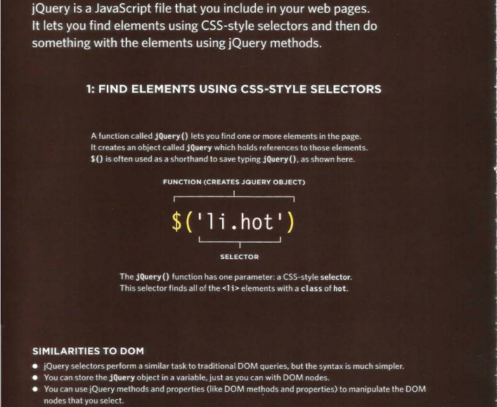
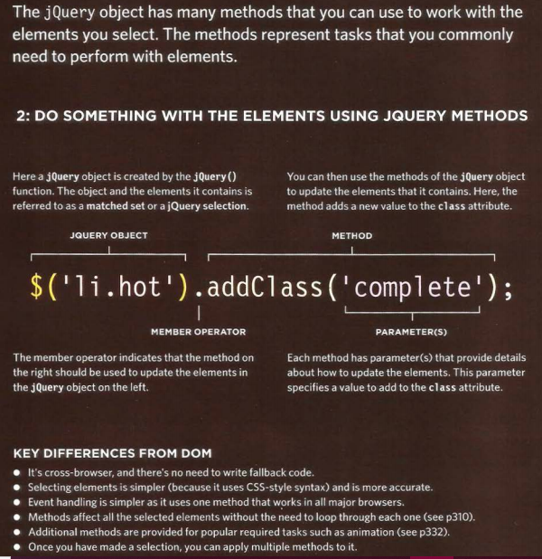
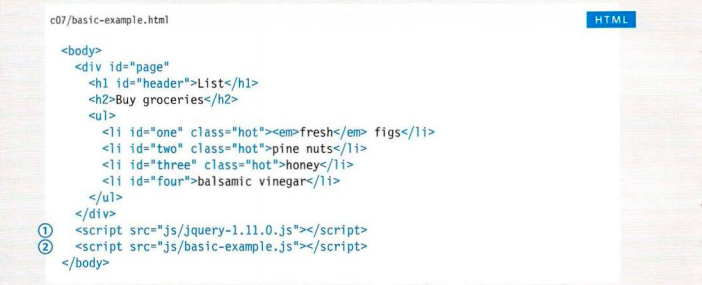
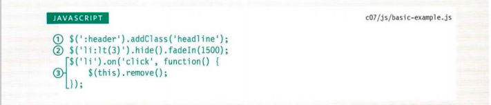
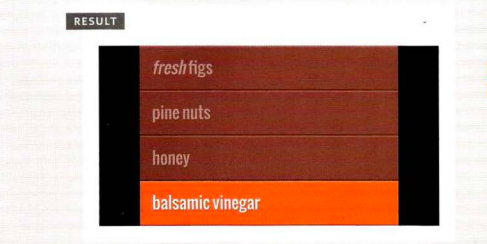

# JQuery
jQuery offers a simple way to achieve a variety of commonJavaScript tasks quickly and consistently, across all major browsers and without any fallback code needed. 

**What can JQuert do?**

- Select Events

- Perform Tasks

- Handle Events

**What is JQuery?**

Example:

**Why use JQuert?**

jQuery doesn't do anything you cannot achieve with pure JavaScript. It is just a JavaScript file but estimates show it has been used on over a quarter of the sites on the web, because it makes coding simpler. 

1- Simple Selectors.

2- Common Tasks in Less Code.

3- Cross-Browser Compatiblity.
