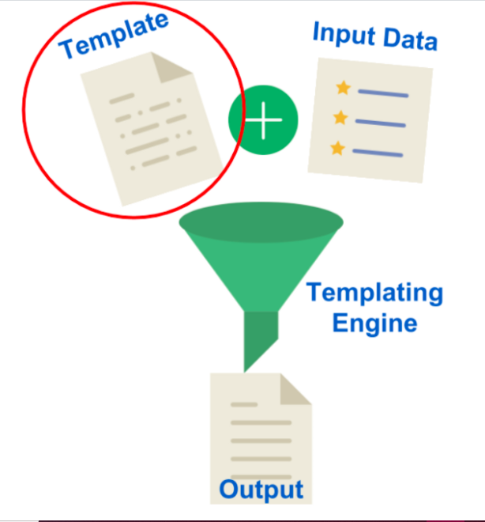

## Javascript Templating
Javascript templating is a fast and efficient technique to render client-side view templates with Javascript by using a JSON data source. The template is HTML markup, with added templating tags that will either insert variables or run programming logic.
The template engine then replaces variables and instances declared in a template file with actual values at runtime, and convert the template into an HTML file sent to the client.

Mustache is a logic-less template syntax. It can be used for HTML, config files, source code — anything. It works by expanding tags in a template using values provided in a hash or object.

It is often referred to as “logic-less” because there are no if statements, else clauses, or for loops. Instead, there are only tags. Some tags are replaced with a value, some nothing, and others a series of values.

mustache.js is an implementation of the mustache template system in JavaScript. It is often considered the base for JavaScript templating. And, since mustache supports various languages, we don’t need a separate templating system on the server side.

```
Mustache.render(“Hello, {{name}}”, { name: “Sherlynn” });
// returns: Hello, Sherlynn
```



## Flexbox

The Flexbox Layout (Flexible Box) module (a W3C Candidate Recommendation as of October 2017) aims at providing a more efficient way to lay out, align and distribute space among items in a container, even when their size is unknown and/or dynamic (thus the word “flex”).

The main idea behind the flex layout is to give the container the ability to alter its items’ width/height (and order) to best fill the available space (mostly to accommodate to all kind of display devices and screen sizes). A flex container expands items to fill available free space or shrinks them to prevent overflow.

Most importantly, the flexbox layout is direction-agnostic as opposed to the regular layouts (block which is vertically-based and inline which is horizontally-based). While those work well for pages, they lack flexibility (no pun intended) to support large or complex applications (especially when it comes to orientation changing, resizing, stretching, shrinking, etc.).

Note: Flexbox layout is most appropriate to the components of an application, and small-scale layouts, while the Grid layout is intended for larger scale layouts.

Since flexbox is a whole module and not a single property, it involves a lot of things including its whole set of properties. Some of them are meant to be set on the container (parent element, known as “flex container”) whereas the others are meant to be set on the children (said “flex items”).

If “regular” layout is based on both block and inline flow directions, the flex layout is based on “flex-flow directions”. Please have a look at this figure from the specification, explaining the main idea behind the flex layout.


