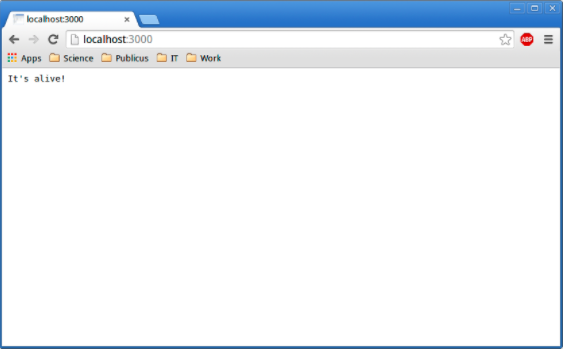
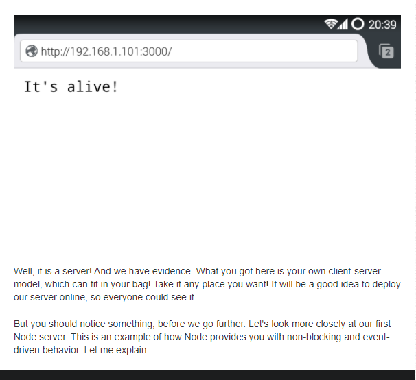

# Node.js For Beginners. Deploy Your Blog to Heroku
Error pages are not what typically appear on your screen when you're surfing the web, but when it happens it's so annoying! To see how servers work from within, we will build a simple web server by ourselves. We will use Node.js as a server part technology for that task. Then we'll use Heroku cloud application platform to turn this local server into a world wide server.

Node.js is an open source, cross-platform runtime environment, which allows you to build server-side and networking applications. It's written in JavaScript and can be run within the Node.js runtime on any platform. First of all, of course, you need to install it. You'd better check the download page for more details. I'll wait until you finish, so don't worry. Is it done? Great! Now you can create your first web server. And it will be one of the easiest tasks in your life.

Pretty simple, but it's a server!

First of all, we need to create a JavaScript file. Let's name it server.js:

```
var http = require("http");

http.createServer(function(request, response) {
  response.writeHead(200, {"Content-Type": "text/plain"});
  response.write("It's alive!");
  response.end();
}).listen(3000);
```

It's simple. It's tiny. But it's a server! Let's make sure it's working. Run at your terminal:

```
node server.js
```

Then check it in your browser. Your new server's address, as you may guess, is http://localhost:3000/ Mine is working. How about yours? Hope, it's working too.



Now, to be sure it's a web server and not just a piece of code that returns a single line of text, we'll use it as a server! You can check it with your smartphone. Let's suppose, your laptop's IP address within your local network is 192.168.1.101. You can connect to your server through the 3000th port (for this particular example) by typing http://192.168.1.101:3000/ in your browser. Works well in my case:



Well, it is a server! And we have evidence. What you got here is your own client-server model, which can fit in your bag! Take it any place you want! It will be a good idea to deploy our server online, so everyone could see it.

But you should notice something, before we go further. Let's look more closely at our first Node server. This is an example of how Node provides you with non-blocking and event-driven behavior. Let me explain:

```
$.post('/some_requested_resource', function(data) {
  console.log(data);
});
```

anonymous function is called. It contains the argument data, which is the data received from that request.

So, Node allows you to use the so-called event loop, which works faster because of non-blocking behavior. For example, nginx uses an event loop with asynchronous I/O. That's why it's fast as hell!

This is not so hard to understand this conception in outline, so let's move along.

Make it worldwide

Works fine. But it works locally. WWW is for "World Wide Web" and we will turn your local server into a world wide server. We'll use Heroku cloud application platform for this. Heroku is a cloud platform as a service (cool long-bearded programmer guys call such type of things "PaaS"). It allows you to deploy your web server, so everyone could see how awesome you are as a web developer. First of all, you need to create an account on developer's site and install Heroku. This is not so hard. Just follow the instructions. There is also instruction on Heroku's site that can explain you how to run your first simple web server, which returns you the "Hello, World!" string. You can try it, but I think that it will be more interesting if we build our own web server from scratch. Sounds exciting, huh?

Look, mom! I'm developing!

First step after Heroku installation is to log in to the system from your computer:

```
heroku login
```

We will leave Heroku for now. But we'll need it soon after we build our server.

Now, the creation. It will be a simple blog with basic functionality. It will show you requested web pages and the error page in case of an error.

Create your project directory. And then create the server.js file inside of it.

First of all, let's declare some variables:

```
var http = require("http");
var fs = require("fs");
var path = require("path");
var mime = require("mime");
```

The first one will give you the key to Node's HTTP functionality. The second one is for possibility to interact with the file system. The third one allows you to handle file paths. The last one allows you to determine a file's MIME-type. And it's not a part of Node.js, so we need to install third-party dependencies before using it. We need to create the package.json file for that purpose. It will contain project related information, such as name, version, description, and so on. For our project we will use MIME-types recognition, because it's not enough to just send the contents of a file when you use HTTP. You also need to set the Content-Type header with proper MIME-type. That's why we need this plug-in.

Create the package.json file and fill it with proper information. Here's mine:
```
{
  "name" : "blog",
  "version" : "0.0.1",
  "description" : "My minimalistic blog",
  "dependencies" : {
    "mime" : "~1.2.7"
  }
}
```


