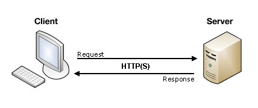
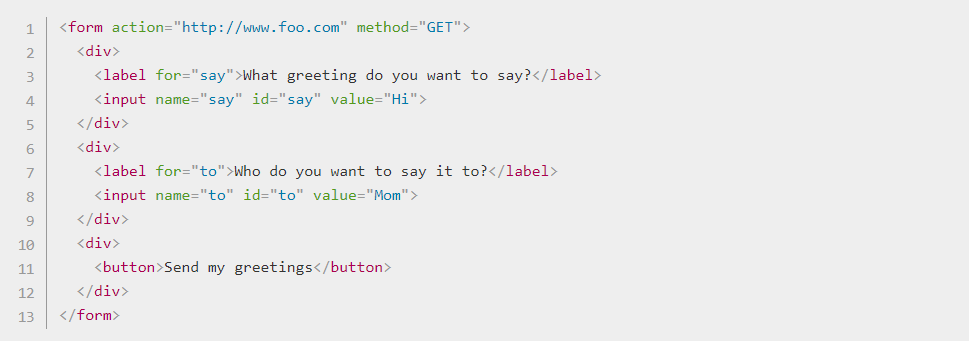
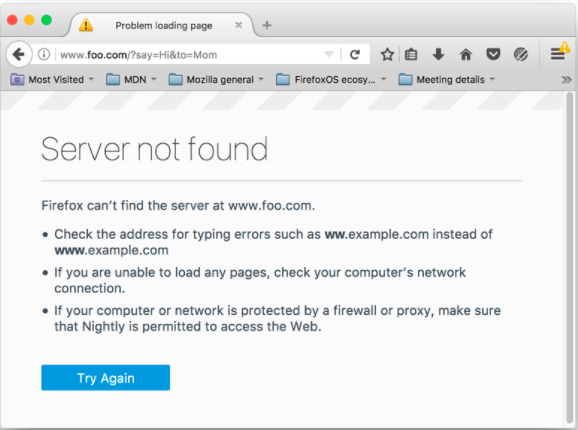

# Client/server architecture
The web uses a client/server architecture that can be summarized as follows:

a client (usually a web browser) sends a request to a server (most of the time a web server like Apache, Nginx, IIS, Tomcat, etc.), using the HTTP protocol.The server answers the request using the same protocol.



An HTML form on a web page is nothing more than a convenient user-friendly way to configure an HTTP request to send data to a server. This enables the user to provide information to be delivered in the HTTP request.

# On the client side: defining how to send the data
The <form> element defines how the data will be sent. All of its attributes are designed to let you configure the request to be sent when a user hits a submit button. The two most important attributes are action and method.
  
**The action attribute** defines where the data gets sent. Its value must be a valid relative or absolute URL. If this attribute isn't provided, the data will be sent to the URL of the page containing the form — the current page.

When specified with no attributes, as below, the <form> data is sent to the same page that the form is present on:
```
<form>
```
The names and values of the non-file form controls are sent to the server as name=value pairs joined with ampersands. The action value should be a file on the server that can handle the incoming data, including ensuring server-side validation. The server then responds, generally handling the data and loading the URL defined by the action attribute, causing a new page load (or a refresh of the existing page, if the action points to the same page).
  
**The method attribute** defines how data is sent. The HTTP protocol provides several ways to perform a request; HTML form data can be transmitted via a number of different methods, the most common being the GET method and the POST method

To understand the difference between those two methods, let's step back and examine how HTTP works. Each time you want to reach a resource on the Web, the browser sends a request to a URL. An HTTP request consists of two parts: a header that contains a set of global metadata about the browser's capabilities, and a body that can contain information necessary for the server to process the specific request.

**The GET method** is the method used by the browser to ask the server to send back a given resource: "Hey server, I want to get this resource." In this case, the browser sends an empty body. Because the body is empty, if a form is sent using this method the data sent to the server is appended to the URL.

Ex:





The data is appended to the URL as a series of name/value pairs. After the URL web address has ended, we include a question mark (?) followed by the name/value pairs, each one separated by an ampersand (&)


**The POST method** is a little different. It's the method the browser uses to talk to the server when asking for a response that takes into account the data provided in the body of the HTTP request: "Hey server, take a look at this data and send me back an appropriate result." If a form is sent using this method, the data is appended to the body of the HTTP request.

When the form is submitted using the POST method, you get no data appended to the URL, and the HTTP request looks like so, with the data included in the request body instead:
```
POST / HTTP/2.0
Host: foo.com
Content-Type: application/x-www-form-urlencoded
Content-Length: 13

say=Hi&to=Mom
```
The Content-Length header indicates the size of the body, and the Content-Type header indicates the type of resource sent to the server.
